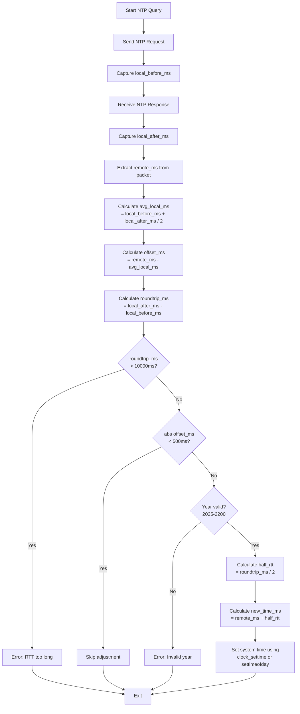

# timesync - C Implementation


[](https://opensource.org/licenses/MIT)

Minimal SNTP client for time synchronization written in C.

## Features

- Minimal dependencies (standard C library and BSD sockets only)
- RFC 5905 subset SNTP implementation
- Cross-platform support (Unix-like systems)
- Verbose logging and test mode
- Syslog support
- Platform-specific variants (Haiku)

## Building

### Standard build

```bash
make
```

The binary will be named `timesync`.

By default, uses `clock_settime` for setting system time (via `-DUSE_CLOCK_SETTIME`).

### Platform-specific notes

**Solaris/Illumos:**
```bash
make LDFLAGS=-lsocket
```

**Haiku:**
The build system automatically uses `timesync_haiku.c` on Haiku systems.

### Manual build

```bash
cc -Os -Wall -Wextra -DUSE_CLOCK_SETTIME -o timesync timesync.c
```

To use `settimeofday` instead, omit the `-DUSE_CLOCK_SETTIME` flag.

On Solaris/Illumos:
```bash
cc -Os -Wall -Wextra -DUSE_CLOCK_SETTIME -o timesync timesync.c -lsocket -lnsl
```

## Usage

```bash
# Query default server (pool.ntp.org)
./timesync

# Query specific server
./timesync time.google.com

# With custom timeout and retries
./timesync -t 1500 -r 2 time.google.com

# Verbose mode
./timesync -v

# Test mode (no system time adjustment)
./timesync -n -v

# Enable syslog logging
./timesync -s
```

## Options

- `-t timeout` : Timeout in milliseconds (default: 2000, max: 6000)
- `-r retries` : Number of retries (default: 3, max: 10)
- `-n` : Test mode (no system time adjustment)
- `-v` : Verbose output
- `-s` : Enable syslog logging
- `-h` : Show help message

## System Time Setting

Setting system time requires root privileges:

```bash
sudo ./timesync
```

The program will only set the system time if:
- Running as root
- Time offset is greater than 500ms
- Remote year is between 2025 and 2200
- Round-trip time is less than 10 seconds

## Installation

```bash
sudo make install    # Install to /usr/local/bin (if target exists)
```

Or manually:

```bash
sudo cp timesync /usr/local/bin/
sudo cp timesync.1 /usr/local/share/man/man1/
```

## Manual Page

A man page is provided in `timesync.1`. View it with:

```bash
man ./timesync.1
```

## Algorithm



**Note:** The Rust implementation uses the identical algorithm with added overflow safety checks (`checked_add()`).

## Supported Platforms

- Linux
- macOS
- FreeBSD
- NetBSD
- OpenBSD
- DragonflyBSD
- Solaris
- Illumos
- Haiku

## Dependencies

- Standard C library only (BSD sockets)
- On Solaris/Illumos: additional `-lsocket -lnsl` linker flags required

## License

MIT License - See [../LICENSE.md](../LICENSE.md)
