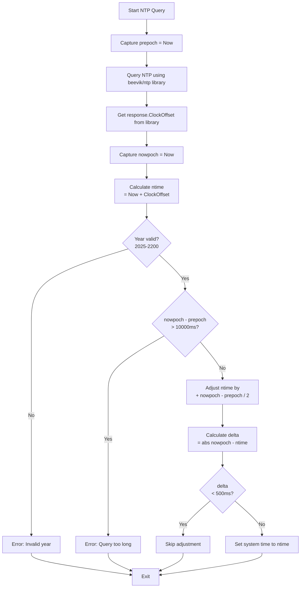

# timesync - Go Implementation


[](https://opensource.org/licenses/MIT)

Minimal SNTP client for time synchronization written in Go.

## Features

- Uses the popular `github.com/beevik/ntp` package
- Cross-platform support with platform-specific time setting
- Verbose logging and test mode
- Syslog integration
- Clean Go idioms and error handling

## Building

### Using Go

```bash
go build
```

### Using Make

```bash
make            # Build local version
make all        # Build all platform-specific versions
```

The binary will be named `timesync`.

### Cross-compilation

The Makefile includes targets for cross-compiling to various platforms:

```bash
make timesync-openbsd-amd64
make timesync-netbsd-amd64
make timesync-freebsd-amd64
make timesync-linux-amd64
make timesync-linux-386
make timesync-linux-riscv64
make timesync-solaris-amd64
```

## Usage

```bash
# Query default server (pool.ntp.org)
./timesync

# Query specific server
./timesync pool.ntp.org

# Verbose mode
./timesync -v

# Test mode (no system time adjustment)
./timesync -n

# Multiple options
./timesync -v -n time.google.com
```

## Options

- `-t timeout` : Timeout in milliseconds (default: 2000, max: 6000)
- `-r retries` : Number of retries (default: 3, max: 10)
- `-n` : Test mode (no system time adjustment)
- `-v` : Verbose output
- `-s` : Enable syslog logging
- `-h` : Show help message

## System Time Setting

Setting system time requires root privileges:

```bash
sudo ./timesync
```

The program will only set the system time if:
- Running as root
- Time offset is greater than 500ms
- Remote year is between 2025 and 2200
- Round-trip time is less than 10 seconds

## Platform-specific Time Setting

The Go implementation includes platform-specific time setting code for:
- macOS (Darwin)
- FreeBSD
- NetBSD
- OpenBSD
- Solaris
- Linux (32-bit and 64-bit)

Each platform has its own `settime-*.go` file with the appropriate system call implementation.

## Algorithm



**Note:** The Go implementation uses the `beevik/ntp` library which handles the low-level SNTP protocol internally. The `ClockOffset` returned by the library is equivalent to the offset calculation in C/Rust implementations.

## Supported Platforms

- Linux (amd64, 386, arm, riscv64, ppc64le)
- macOS (Darwin)
- FreeBSD
- NetBSD
- OpenBSD
- Solaris

## Dependencies

- [github.com/beevik/ntp](https://github.com/beevik/ntp) - Go package for querying NTP servers
- Standard Go library

## License

MIT License - See [../LICENSE.md](../LICENSE.md)
