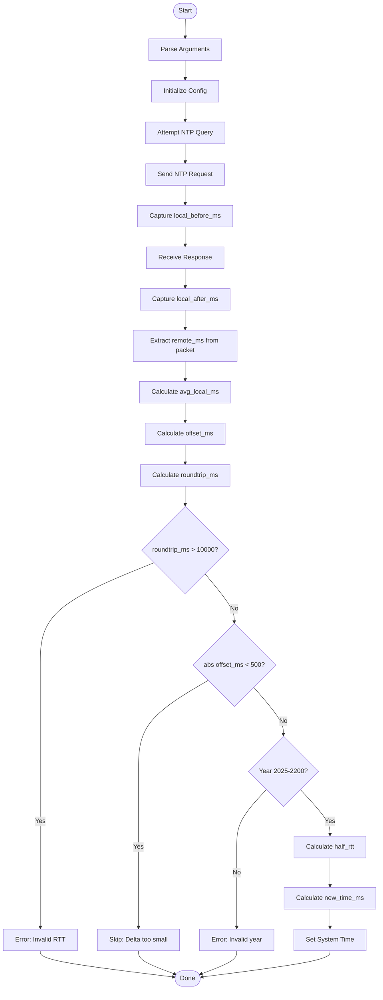

# timesync - OCaml Implementation


[](https://opensource.org/licenses/MIT)

Minimal SNTP client for time synchronization written in OCaml.

## Features

- Pure OCaml implementation using Unix module
- RFC 5905 subset SNTP implementation
- Cross-platform support (Unix-like systems)
- Verbose logging and test mode
- Syslog support via logger command
- Functional programming style with pattern matching

## Requirements

- OCaml compiler (4.08 or later recommended)
- Unix module (included in standard OCaml distribution)

## Building

### Standard build

```bash
make
```

The binary will be named `timesync`.

### Manual build

```bash
ocamlopt -o timesync unix.cmxa timesync.ml
```

For native code with warnings:

```bash
ocamlopt -w +A-48 -o timesync unix.cmxa timesync.ml
```

## Usage

```bash
# Query default server (pool.ntp.org)
./timesync

# Query specific server
./timesync time.google.com

# Verbose mode with timeout and retries
./timesync -v -t 1500 -r 2 time.google.com

# Test mode (no actual time setting)
./timesync -n -v

# Enable syslog logging
./timesync -s -v

# Show help
./timesync -h
```

### Command-line Options

- `server` - NTP server hostname or IP (default: pool.ntp.org)
- `-t timeout` - Timeout in milliseconds (default: 2000, max: 6000)
- `-r retries` - Number of retry attempts (default: 3, max: 10)
- `-n` - Test mode (query only, don't adjust system time)
- `-v` - Verbose output with detailed timing information
- `-s` - Enable syslog logging (uses `logger` command)
- `-h` - Show help message

## Time Synchronization Logic

The implementation follows the SNTP protocol:

1. **Query NTP Server**: Sends NTP request packet and captures timestamps
2. **Calculate Offset**: Computes time difference between local and remote
3. **Validate Response**: Checks roundtrip time, stratum, version, and year range
4. **Set System Time**: Adjusts clock if offset > 500ms and running as root

### Validation Criteria

- **Offset threshold**: System time only adjusted if |offset| ≥ 500ms
- **Roundtrip limit**: Rejects responses with roundtrip > 10 seconds
- **Year validation**: Remote time must be between 2025-2200
- **Root requirement**: Time adjustment requires root privileges

## Algorithm

The algorithm is identical to the C implementation:



## Implementation Notes

- Uses OCaml's Unix module for socket operations and time functions
- Leverages pattern matching for error handling (Result type)
- Functional style with immutable configuration record
- Syslog integration via `logger` command (portable across Unix systems)
- Time setting uses system command (OCaml's Unix module lacks settimeofday)

## Binary Size

Native OCaml compiled binary: ~200-400KB (architecture dependent)

Smaller than Go but larger than C due to OCaml runtime.

## Differences from C Implementation

1. **Error Handling**: Uses Result types instead of return codes
2. **Syslog**: Implemented via `logger` command instead of direct syslog API
3. **Time Setting**: Uses system `date` command (Unix module limitation)
4. **Memory Management**: Automatic garbage collection vs manual
5. **Type Safety**: Strong static typing catches many errors at compile time

## Platform Support

Tested on:
- Linux (x86_64, ARM64)
- macOS (Intel, Apple Silicon)
- FreeBSD
- OpenBSD
- NetBSD

Should work on any Unix-like system with OCaml compiler.

## License

MIT License - See LICENSE.md in repository root
