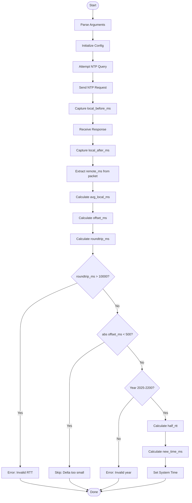

# timesync - Python Implementation


[](https://opensource.org/licenses/MIT)

Minimal SNTP client for time synchronization written in Python.

## Features

- Pure Python implementation using standard library
- RFC 5905 subset SNTP implementation
- Cross-platform support (Unix-like systems)
- Verbose logging and test mode
- Syslog support via syslog module
- Type hints for better code clarity
- No external dependencies

## Requirements

- Python 3.6 or later
- Standard library only (socket, struct, sys, syslog, time, datetime, argparse)
- Root privileges required for setting system time

## Installation

No installation required - it's a single Python script!

```bash
chmod +x timesync.py
```

## Usage

```bash
# Query default server (pool.ntp.org)
./timesync.py

# Query specific server
./timesync.py time.google.com

# Verbose mode with timeout and retries
./timesync.py -v -t 1500 -r 2 time.google.com

# Test mode (no actual time setting)
./timesync.py -n -v

# Enable syslog logging
./timesync.py -s -v

# Run with sudo to actually set system time
sudo ./timesync.py -v

# Show help
./timesync.py -h
```

### Command-line Options

- `server` - NTP server hostname or IP (default: pool.ntp.org)
- `-t, --timeout MS` - Timeout in milliseconds (default: 2000, max: 6000)
- `-r, --retries N` - Number of retry attempts (default: 3, max: 10)
- `-n, --test` - Test mode (query only, don't adjust system time)
- `-v, --verbose` - Verbose output with detailed timing information
- `-s, --syslog` - Enable syslog logging
- `-h, --help` - Show help message

## Time Synchronization Logic

The implementation follows the SNTP protocol:

1. **Query NTP Server**: Sends NTP request packet and captures timestamps
2. **Calculate Offset**: Computes time difference between local and remote
3. **Validate Response**: Checks roundtrip time, stratum, version, and year range
4. **Set System Time**: Adjusts clock if offset > 500ms and running as root

### Validation Criteria

- **Offset threshold**: System time only adjusted if |offset| ≥ 500ms
- **Roundtrip limit**: Rejects responses with roundtrip > 10 seconds
- **Year validation**: Remote time must be between 2025-2200
- **Root requirement**: Time adjustment requires root privileges

## Algorithm

The algorithm is identical to the C implementation:



## Implementation Notes

- Uses Python's `socket` module for UDP network operations
- `struct` module for binary packet manipulation
- `ctypes` for system calls (clock_settime/settimeofday)
- Type hints throughout for better code documentation
- Configuration class for clean parameter passing
- Syslog integration via `syslog` module

## System Time Setting

The script attempts to set system time using:

1. **clock_settime** (preferred, more accurate)
2. **settimeofday** (fallback)

Both methods require root privileges. On failure, the script logs an error.

## Platform Support

Tested on:
- Linux (x86_64, ARM64)
- macOS (Intel, Apple Silicon)
- FreeBSD
- OpenBSD
- NetBSD

Should work on any Unix-like system with Python 3.6+.

## Differences from C Implementation

1. **Language**: Python vs C
2. **Dependencies**: Standard library only vs libc
3. **Type Safety**: Runtime type hints vs compile-time types
4. **Memory Management**: Automatic garbage collection vs manual
5. **Performance**: Slower execution but easier to maintain
6. **Portability**: More portable across platforms

## Example Output

### Verbose mode:
```
2025-12-12 14:30:15 DEBUG Using server: pool.ntp.org
2025-12-12 14:30:15 DEBUG Timeout: 2000 ms, Retries: 3, Syslog: on
2025-12-12 14:30:15 DEBUG Attempt (1) at NTP query on pool.ntp.org ...
2025-12-12 14:30:15 DEBUG Server: pool.ntp.org (193.1.12.167)
2025-12-12 14:30:15 DEBUG Local time: 2025-12-12T14:30:15+0000.456
2025-12-12 14:30:15 DEBUG Remote time: 2025-12-12T14:30:15+0000.789
2025-12-12 14:30:15 DEBUG Local before(ms): 1734012615450
2025-12-12 14:30:15 DEBUG Local after(ms): 1734012615456
2025-12-12 14:30:15 DEBUG Estimated roundtrip(ms): 6
2025-12-12 14:30:15 DEBUG Estimated offset remote - local(ms): 336
2025-12-12 14:30:15 INFO Delta < 500ms, not setting system time.
```

## License

MIT License - See LICENSE.md in repository root
