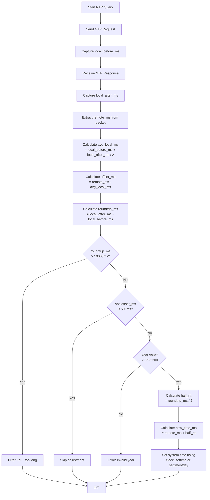

# timesync - Rust Implementation


[](https://opensource.org/licenses/MIT)

Rust port of the minimal SNTP client for time synchronization.

## Features

- Minimal dependencies (only `libc` and `chrono`)
- Direct port of the C implementation logic
- RFC 5905 subset SNTP implementation
- Cross-platform support (Unix-like systems)
- Verbose logging and test mode
- Safe Rust with minimal unsafe code (only for system calls)

## Building

### From source with Cargo

```bash
cargo build --release
```

The binary will be at `target/release/timesync`.

By default, uses `clock_settime` for setting system time. To use `settimeofday` instead:

```bash
cargo build --release --features use_settimeofday
```

### Using Make

```bash
make            # Build release version and strip
make debug      # Build debug version
make clean      # Clean build artifacts
```

## Usage

```bash
# Query default server (pool.ntp.org)
./target/release/timesync

# Query specific server
./target/release/timesync time.google.com

# With custom timeout and retries
./target/release/timesync -t 1500 -r 2 time.google.com

# Verbose mode
./target/release/timesync -v

# Test mode (no system time adjustment)
./target/release/timesync -n -v
```

## Options

- `-t timeout` : Timeout in milliseconds (default: 2000, max: 6000)
- `-r retries` : Number of retries (default: 3, max: 10)
- `-n` : Test mode - do not set system time
- `-v` : Verbose output
- `-s` : Enable syslog logging
- `-h` : Show help message

## Installation

```bash
make install    # Install to /usr/local/bin
make uninstall  # Remove from /usr/local/bin
```

Or manually:

```bash
sudo cp target/release/timesync /usr/local/bin/
```

## System Time Setting

Setting system time requires root privileges:

```bash
sudo ./target/release/timesync
```

The program will only set the system time if:
- Running as root
- Time offset is greater than 500ms
- Remote year is between 2025 and 2200
- Round-trip time is less than 10 seconds

## Differences from C Version

- Uses Rust's type safety and memory safety features
- Minimal `unsafe` code (only for `clock_settime`/`settimeofday` and `getuid` system calls)
- Uses `chrono` crate for datetime formatting
- Uses `syslog` crate for syslog support
- Error handling with Result types
- More idiomatic Rust patterns while maintaining C version's logic
- Supports both `clock_settime` (default) and `settimeofday` via feature flag

## Algorithm



**Note:** This is identical to the C implementation algorithm. Rust adds overflow safety checks using `checked_add()` for the calculations.

## Supported Platforms

- Linux
- macOS
- FreeBSD
- NetBSD
- OpenBSD
- Other Unix-like systems with `clock_settime`/`settimeofday` support

## Dependencies

- `libc` 0.2 - For Unix system calls
- `chrono` 0.4 - For datetime handling and formatting
- `syslog` 7.0 - For syslog support

## License

MIT License - See [../LICENSE.md](../LICENSE.md)
